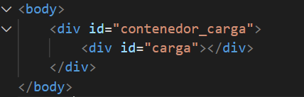
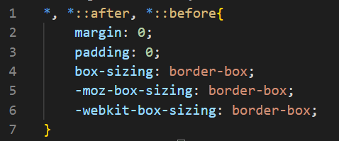
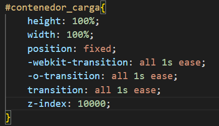

# Ejercicio Indicador de Carga

#### Pre-requisitos:
No es necesario nigun pre-requisito especifico para realizar este mini proyecto, solo necesitas un editor de codigo de preferencia.

> De usar Visual Studio Code es recomendable instalar la extencion `Live Server` [pagina de descarga](https://marketplace.visualstudio.com/items?itemName=ritwickdey.LiveServer)


#### Inicio del proyecto:
Escribe codigo en los archivos `index.html` y `styles.css` para crear el `Indicador de carga` o `Loading page`:

> Nota: la propiedades que comienzan con `-webkit-` son implementadas para ser compatibles con los navegadores `Explorer`
> Nota: la propiedades que comienzan con `-moz-` son implementadas para ser compatibles con los navegadores `Mozilla`
> Nota: la propiedades que comienzan con `-o-` son implementadas para ser compatibles con los navegadores `Opera`


- En el index.html crea 2 etiquetas `<div>` con un `id` diferente para cada uno, una de las etiquetas debe quedar dentro de la otra.

```html
    <div class="contenedor_carga">
        <div class="carga">
        </div>
    </div>
```


#### Agregar estilos:
- En el style.css procedemos a trabajar con los estilos para darle forma.

> Este primer paso es opcional, ya que tiene poca influencia en el resultado final, solo nos ayuda a dimencionar el Loading de un tamaño en especifico.-webkit-

* Aplicamos las propiedades `margin` y `padding` en 0 para evitar margenes en todos los elementos del HTML y para eso haremos uso del selector universal (*), tambien haremos uso del artibuto `box-sizing`con un comportamiento `border-box` el cual nos hara mucho más fácil dimensionarlos, al darle valores a su tamaño de ancho y largo se limitaran a ocupar este.

```css
    *, *::after, *::before{
        margin: 0;
        padding: 0;
        box-sizing: border-box;
        -moz-box-sizing: border-box;
        -webkit-box-sizing: border-box;
    }
```


* En este punto aplicamos las propiedades `height`, `width`, `position`, `transition` y `z-index`

    1. A las propiedades `height` y `width` con un valor del 100% en ambos para de esta manera abarcar la pagina en su totalidad.

    2. La propiedad `position` con un comportamiento `fixed` para evitar que se nos mueva el elemento de pocision independientemente del tamaño de la pantalla.

    3. La propiedad `transition` cuyos yalores seran `all 1s ease` que significa `nombre de la propiedad a la que se va aplicar | duración | función ` en este caso se le esta aplicando a todas las propiedades de este `div` con un tiempo de duracion de `1s` en cual esta transicion comienza lento, aumenta su velocidad y termina de aplicarse lento (`ease`)
    
    4. Por ultimo la propiedad `z-index` con un valor alto para que de posicione enfrente del contenido que ya se visualiza en el DOM,(para este ejemplo se implemento un valor de 10000)

> Se le puede agregar algun color de fondo con transparencia para de este modo opacar el contenido previo que se encuentre en la pagina donde se aplique.

```css
    #contenedor_carga{
        height: 100%;
        width: 100%;
        position: fixed;
        -webkit-transition: all 1s ease;
        -o-transition: all 1s ease;
        transition: all 1s ease;
        z-index: 10000;
    }
```



